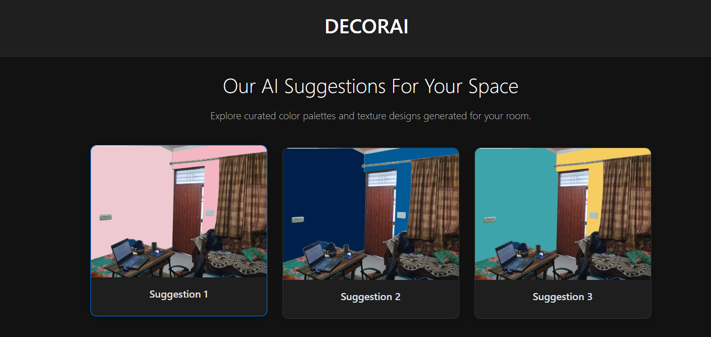
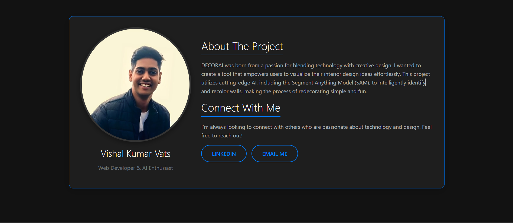

<div align="center">
  <h1 align="center">🎨 DECORAI 🎨</h1>
  <h3><i>Where Technology Meets Design</i></h3>
  <p>
    An intelligent interior design application that uses the power of AI to help you visualize new wall colors and textures in your own space in seconds.
  </p>
</div>

<br>





---

## 🌟 Overview

Redecorating a room often starts with a fresh coat of paint, but choosing the right color can be an overwhelming and costly decision. DECORAI solves this problem by providing a robust system that allows homeowners to see how their rooms would look before ever picking up a paintbrush.

The application uses advanced deep learning techniques, including Meta AI's **Segment Anything Model (SAM)**, to automatically detect walls while intelligently ignoring complex objects like furniture and decor. Users can instantly apply new colors, explore AI-generated recommendations, and even experiment with different textures to find the perfect look for their space.

---

## ✨ Key Features

- **🤖 AI-Powered Wall Detection**: Automatically identifies walls in any uploaded photo.
- **🎨 Instant Color Visualization**: Select any color and see it applied to your walls in real-time.
- **💡 Smart Suggestions**: Get AI-generated color palettes and texture recommendations tailored to your room.
- **🖱️ Interactive Point-and-Click Interface**: Simply click on any surface you want to change.
- **📱 Modern & Responsive Design**: A clean, user-friendly interface that works on any device.

---

## 🛠️ Tech Stack

- **Backend**: Django, Python
- **AI Model**: Segment Anything Model (SAM)
- **Frontend**: HTML, CSS, JavaScript, Bootstrap
- **Image Processing**: Pillow, OpenCV
- **Database**: SQLite (for development)

---


### To run this project :

Clone the project -
```
  https://github.com/vishalvats0411-web/DecorAI.git
```

Download the SAM model from the [link](https://dl.fbaipublicfiles.com/segment_anything/sam_vit_h_4b8939.pth)
``` 
 create a folder named checkpoints inside main/static directory and paste the model file in there
```
  
- ### Start the server -
```
  cd DecorAI
 ``` 
Install all the reqirements -
```
  pip install -r requirements.txt
 ``` 
Run the following commands -

 for linux/mac :
``` 
   python3 manage.py migrate
   python3 manage.py makemigrations
``` 
 for windows :
 ``` 
   python manage.py migrate
   python manage.py makemigrations
 ``` 
Start the project -

 for linux/mac :
```
   python3 manage.py runserver
```  
 for windows :
``` 
  python manage.py runserver
```
---
<h3 align="center"><b>Developed with :heart: by <a href="https://github.com/vishalvats0411-web">Vishal Kumar Vats</a>


